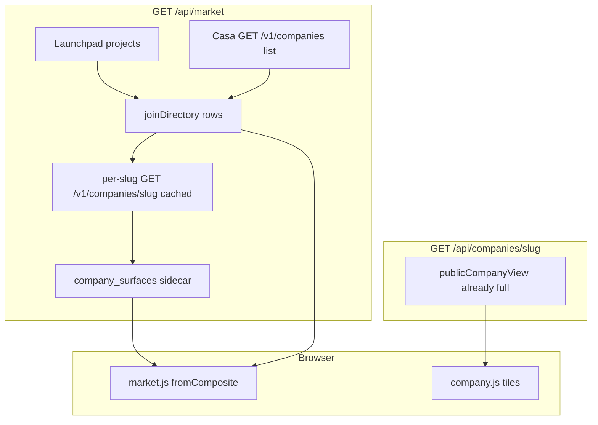

# Company Casa Tiles - Plan

**Target repo:** Capx-AI/terminal (local working tree `terminal-deployment/`).
Implement from `origin/main` (`e0e8f41` at plan time). Local HEAD `68178d2` is stale and missing the company page.

## Goal Capsule

- **Objective:** Show the Casa company record on `/c/{slug}` (AgentGraph, Arbiter, and the rest) with the same lime tiles the XX1 token page already paints, minus price. Fill the market table's company-only work columns from that record. Tokenless price stays dash.
- **Authority:** This plan. Live Terminal at `terminal.capx.ai`. Tile map: `docs/TERMINAL-AGENT-SURFACE.md`. Join contract: `ORCHESTRATOR/casa-terminal-plan-01/contracts/terminal-composite-row.schema.json`. Company GET: `ORCHESTRATOR/casa-terminal-plan-01/contracts/company.schema.json`.
- **Stop:** Company pages paint constraint, vitals, reproduced checks, ledger, envelope, judgment, departments, work stats, and heatmap when those blocks exist. Market company rows show tasks, heatmap, build map, coverage, chain when present. Tokenless `market.*` stays JSON null and UI `--`. Token page `/t/{mint}` is unchanged.
- **Out of scope:** Invented price. Joining XX1 into `/c/xx1`. Thickening token-only rows with no Casa company. Casa API changes. Refactoring `web/token.js`.

## Product Contract

### Summary

Paint the missing Casa company record on company pages and on market company rows. Price and Codex series stay empty when there is no token.

### Problem Frame

XX1 at `/t/FYh843de7T4v1wwpQQZUHasJbrWbsb7SHx3oSoQDcapx` is rich because `GET /api/tokens/{mint}` attaches the full Casa mint document and `web/token.js` paints ten lime tiles. AgentGraph and Arbiter are `company_without_token` rows. Their full record already exists at `GET /v1/companies/{slug}` and is already proxied by `GET /api/companies/{slug}`. The company page only paints identity, artifact iframes, a progress strip, heatmap, and ladder. The market table already has Tasks / Heatmap / Build map / Coverage / Chain cells, but `fromComposite` never receives a Casa document for a slug-only row, and `calCell` dashes when `row.mint` is missing.

### Requirements

**Company page**

- R1. `/c/{slug}` paints the token-page Casa tiles when the company document contains that block: work stats, constraint, vitals, reproduced checks, disclosed ledger, envelope, judgment, departments 30d. Heatmap and ladder already exist and stay.
- R2. Hide a Casa tile when its JSON block is absent or empty. Do not dash-fill a missing ledger, judgment list, or department board. Do not paint 180 hollow heatmap days for a two-day-old company.
- R3. Keep the existing Market/Price tile and chart tile as they are for tokenless companies (dashes and "No token yet"). Do not invent USD, FDV, volume, or a Codex line.
- R4. Keep the sandboxed website / one-pager / deck showcase. Do not weaken iframe sandbox or paint logos with `innerHTML`.
- R5. Provenance grammar stays: `attested` is reserved; constraint / north star / win / last session are claimed; health / freshness / coverage / chain are reproduced. No "verified". No yield / profit / equity / revenue copy. No em-dashes in product copy.

**Market table**

- R6. Company-only rows fill Tasks (7d), Heatmap, Build map, Coverage, and Chain from the company record when those fields exist. Missing fields stay `--`, never `0`.
- R7. Tokenless market columns (`price_usd`, `fdv_usd`, `volume_24h_usd`, `liquidity_usd`, `change_24h_percent`) stay JSON `null` and UI `--`.
- R8. Directory assembly still must not `GET /v1/tokens/{mint}`. Company work on the table comes from the company slug document, not the mint GET.

**Unchanged**

- R9. `/c/{slug}` survives later token attach. Kind may change; slug and URL do not.
- R10. Browser never calls Casa. Backend cache for directory remains ~60s.

### Actors

- A1. Public visitor on `terminal.capx.ai`.
- A2. Terminal backend (Vercel `server.mjs`).
- A3. Casa `GET /v1/companies` and `GET /v1/companies/{slug}`.

### Key Flows

- F1. Open `/c/agentgraph`
  - **Trigger:** Click a company-only market row.
  - **Steps:** Browser `GET /api/companies/agentgraph`. Terminal returns `publicCompanyView`. Page paints identity, artifacts, progress strip, then each Casa tile that has a feed.
  - **Outcome:** Constraint, vitals, checks, ledger, envelope, departments show when present. Price stays "No token yet."
- F2. Load `/`
  - **Trigger:** Market overview.
  - **Steps:** `GET /api/market` joins the thin company list with Launchpad. Sidecar `company_surfaces` is filled from cached slug GETs. `fromComposite` merges sidecar into row getters. `calCell` draws from heatmap even without a mint.
  - **Outcome:** AgentGraph row shows health, tasks, heatmap, build map, coverage, chain. Price columns stay `--`.
- F3. Company GET missing a block
  - **Trigger:** Fixture or live company with progress but empty `decisions.items` and empty `ledger.shown`.
  - **Outcome:** Those tiles stay hidden. Progress strip and tiles with data still show.
- F4. Casa slug GET fails for one company
  - **Trigger:** One of N slug fetches 5xx/404 during market assembly.
  - **Outcome:** That row's work columns dash. Other rows still fill. Whole market does not 500. Tokenless price stays null.

### Acceptance Examples

- AE1. Covers F1 / R1 / R3. Given live AgentGraph (`25/122` playbooks, 4 ledger events, coverage 10000 bp, no token). When `/c/agentgraph` loads. Then constraint, vitals, reproduced, ledger, envelope, departments, heatmap, ladder are visible. Market price and chart still say no token. No USD number appears.
- AE2. Covers F2 / R6 / R7. Given the same company on `/`. When the market table renders the AgentGraph row. Then Tasks is `4` (or the live `tasks_7d`), heatmap is not `--`, coverage is not `--`, chain is `0` or the live sequence. Price / 24h / vol / liq / FDV / spark are `--`.
- AE3. Covers F3 / R2. Given a company document with `decisions.items = []` and no department events. When the company page paints. Then judgment and departments tiles are hidden. Tiles with data remain.
- AE4. Covers R7 / R8. Given `/api/market` for a `company_without_token` row. Then `market` is all-null. Payload does not include a per-mint Casa GET. Join goldens still validate.

### Success Criteria

- AgentGraph and Arbiter company pages show the lime record XX1 already shows, except price.
- Market company rows stop looking empty in the Casa columns.
- XX1 token page still paints as today.
- `node --test web/test/*.test.mjs` and `node web/e2e.mjs` pass against `origin/main` plus this work.

### Scope Boundaries

**In**

- Company page Casa tiles (minus price).
- Market table company work columns via a sidecar, not a join-schema change.
- SAMPLE company docs rich enough to prove the tiles locally.

**Deferred to Follow-Up Work**

- Extract shared painters from `web/token.js` (do not touch the XX1 page in this work).
- Bind XX1 into `GET /v1/companies` / `/c/xx1`.
- Casa list endpoint widening so market can skip per-slug GETs.
- Token-only pages with no company document.

**Outside this product's identity**

- Invented price, DexScreener, raise-derived USD.
- Terminal account DB, restyle, `/api/attest/*`.
- Yield / profit / equity copy.

## Planning Contract

### Key Technical Decisions

- KTD1. Leave `web/token.js` and `web/token.html` unchanged. Copy tile markup and painters onto the company page. (Chosen over extracting a shared module: XX1 is the only rich live page; a mechanical extract is follow-up.)
- KTD2. Do not add fields to `joinDirectory` rows. The composite schema is `additionalProperties: false`. Attach a sidecar `company_surfaces` on `GET /api/market`, keyed by slug. `fromComposite` merges it. (Chosen over amending `ORCHESTRATOR/.../terminal-composite-row.schema.json`: this work is Terminal-only.)
- KTD3. Fill the sidecar with per-slug `GET /v1/companies/{slug}` (cached ~60s, parallel, one failure does not fail the market). This is not a per-mint `GET /v1/tokens/{mint}`. Project a slim document: attestation, reproduced coverage/signature/chain, progress level/playbooks/`work.tasks_7d`, calendar or heatmap buckets. Do not put ledger/envelope/done_nodes on the market payload.
- KTD4. Hide empty Casa tiles on the company page. Token page keeps always-chrome empty copy. (session-settled: user-directed — chosen over always showing XX1 chrome: Phase-0 companies should not show empty judgment.)
- KTD5. Keep company-page Market/Price and chart tiles as empty chrome when there is no token. (session-settled: user-directed — chosen over hiding those tiles or filling them: "other than the price".)
- KTD6. Keep `#tile-work` as the company progress strip (health as the big number). Extend its minirow with artifacts, rubrics, events, in flight from `progress.work`. Do not replace health with tasks-7d (that is the token-page meaning of the same id).
- KTD7. `calCell` / `drawCal` must key heatmap by slug when mint is absent. Today's `if (!row.mint) return dash()` is why company heatmaps cannot render even after a sidecar exists.

### High-Level Technical Design

Company page layout after identity and showcase: progress strip, pulse, empty market, empty chart, then cons / vitals / repro / wire / env / ladder / judge / dept / five planes. Hide cons, vitals, repro, wire, env, judge, dept when their feed is empty. Pulse already hides with no calendar days. Ladder stays if `progress.levels` exists (AgentGraph has it).

### Assumptions

- Live `GET /v1/companies/{slug}` keeps returning the same lime blocks AgentGraph already returns (`progress`, `attestation`, `reproduced`, `calendar`, `ledger`, `envelope`, `departments_30d`).
- Fourteen parallel slug GETs on a 60s cache is acceptable for current directory size. If Casa later widens the list, the sidecar can be filled from the list instead.
- SAMPLE localhost remains the test surface; production visual proof is `terminal.capx.ai/c/agentgraph` after deploy.

### Implementation Constraints

- Work from `origin/main`. Do not implement against the stale checkout.
- `web/vercel.json` `includeFiles` must list any new JS. `web/test/a11y-outage.test.mjs` asserts the pack list.
- Logos: DOM nodes plus `isCasaUrl` allowlist (TR-04). Painters that use `innerHTML` must `F.esc`.
- Ledger `note` stays stripped (`redactLedger` in `web/company.mjs`).
- No em-dashes in UI copy. Existing middot is fine.
- Tests live under `web/test/` with `node:test`. Goldens stay in `ORCHESTRATOR/casa-terminal-plan-01/contracts/golden/` and must keep validating.

### Sequencing

U1 sidecar and market.js (table can light up before the company page looks finished). U2 company page tiles. U3 fixtures, e2e, packaging, contract note.

## Implementation Units

### U1. Market sidecar and company-column paint

**Goal:** Company-only market rows show tasks, heatmap, build map, coverage, and chain from the company slug document, with tokenless price still null.

**Requirements:** R6, R7, R8, R10. KTD2, KTD3, KTD7.

**Dependencies:** none

**Files:**
- `web/server.mjs` — after `joinDirectory`, load slim surfaces for company slugs; attach `company_surfaces`; do not call `loadCasa`
- `web/company.mjs` — `marketSurface(view)` projection helper
- `web/market.js` — `fromComposite` merge sidecar; `calCell`/`drawCal` without mint gate
- `web/test/join-directory.test.mjs` — still no per-mint GET; sidecar is not on `rows[]`
- `web/test/filters-search.test.mjs` — company-only work columns; tokenless price still dash/null

**Approach:** Reuse `loadCompanyBySlug` + `publicCompanyView` with a slug cache TTL matching the companies list (~60s). `Promise.all` over unique slugs on company-kind rows. On failure, omit that slug from the sidecar. `marketSurface` copies only fields market getters need. `fromComposite` sets `casa.document` from the sidecar so `tasks7dOf` / `coverageOf` / `seqOf` / `progressOf` work unchanged. Heatmap: `buildHeatmap(null, view)` already exists. `POST /api/register` already drops the companies list snapshot; drop the slug-surface cache in the same place so a newly redeemed company is not stuck dash for 60s.

**Execution note:** Start with a failing test that a `company_without_token` row with a sidecar paints tasks and still has `market.price_usd === null`.

**Patterns to follow:** `joinDirectory` purity; `honestMarket` / `tokenless-market-zero.json`; `web/test/join-directory.test.mjs` "directory path does not use CASA_TTL_MS".

**Test scenarios:**
- Happy: sidecar present → Tasks / coverage / chain / build map render numbers; heatmap SVG not `--`.
- Happy: tokenless `market` all-null in JSON and `--` in HTML.
- Edge: sidecar missing for one slug → that row dashes work columns; others fill.
- Edge: `calCell` with slug + heatmap, no mint → draws cells.
- Error: slug GET 503 → market 200, that slug omitted from sidecar.
- Integration: `/api/market` handler does not request `/v1/tokens/{mint}`.

**Verification:** `node --test web/test/join-directory.test.mjs web/test/filters-search.test.mjs`. Live `GET /api/market` AgentGraph row no longer dashes Tasks/Coverage after deploy.

### U2. Company page Casa tiles

**Goal:** `/c/{slug}` shows the lime record (minus price) using the document `GET /api/companies/{slug}` already returns.

**Requirements:** R1–R5, R9. KTD1, KTD4, KTD5, KTD6.

**Dependencies:** none (can land parallel with U1; uses existing company payload)

**Files:**
- `web/company.html` — add token-page tile sections: `t-cons`, `t-vitals`, `t-repro`, `t-wire`, `t-env`, `t-judge`, `t-dept` (ids and inner structure copied from `web/token.html`). Keep showcase, price, chart, pulse, ladder, attest.
- `web/company.js` — painters copied from `web/token.js` (`paintConstraint`, `paintVitals`, `paintRepro`, `paintWire`, `paintEnvelope`, `paintJudgment`, `paintDepts`) operating on `payload.company`. Per-tile `hidden` when feed empty. Extend `paintProgress` minirow with work artifacts/rubrics/events/in flight. Do not change `paintMarket` / `paintChart` empty behavior.
- `web/test/company-page.test.mjs` — tile ids present; empty-block hidden; tokenless price still `--`; iframe sandbox unchanged; logo still DOM nodes

**Approach:** Treat `payload.company` as the token page's `doc` (same field paths: `progress.constraint`, `reproduced`, `ledger.shown`, `envelope`, `departments_30d`, `decisions.items`). Hide rules:

| Tile | Show when |
|---|---|
| cons | `progress.constraint` is an object |
| vitals | progress or reproduced present |
| repro | `reproduced` present |
| wire | `ledger.shown.length > 0` |
| env | `envelope` present |
| judge | `decisions.items.length > 0` (constraint already has its own tile) |
| dept | some `departments_30d.items[].events > 0` |
| pulse | calendar days exist (already) |
| ladder | `progress.levels.length > 0` (already paints empty meta otherwise; hide if no levels and unobserved) |
| price / chart | always, current empty copy (KTD5) |

Copy token empty-state copy only for tiles that are shown. Keep `F.esc` on every interpolated string. Do not use `innerHTML` for logos.

**Patterns to follow:** `web/token.js` painters and `docs/TERMINAL-AGENT-SURFACE.md` tile map. Company `paintIdentity` DOM logo. `IFRAME_SANDBOX = allow-scripts` only.

**Test scenarios:**
- Covers AE1. Fixture/live AgentGraph-shaped doc → cons, vitals, repro, wire, env, dept visible; price `--` / "No token yet."
- Covers AE3. Empty decisions and empty departments → those two tiles `hidden`.
- Unobserved progress → work minirow `--` / "No pushes yet.", no fake zero.
- Sandbox attribute still `allow-scripts` only; no `allow-same-origin`.
- Logo painted with `createElement("img")`, not `innerHTML`.
- `/c/{slug}` still 404s private/unready with Casa error codes.

**Verification:** `node --test web/test/company-page.test.mjs`. Manual: `https://terminal.capx.ai/c/agentgraph` after deploy matches AE1.

### U3. Fixtures, e2e, packaging, contract note

**Goal:** Local SAMPLE and e2e can prove the tiles. Vercel packs any new assets. Contract records the sidecar and hide-empty rule.

**Requirements:** R1, R6, R10.

**Dependencies:** U1, U2

**Files:**
- `web/company.mjs` `SAMPLE_COMPANY_DOCS` — add `work`, `constraint`, `reproduced`, `calendar`, `ledger.shown`, `envelope`, `departments_30d` to `northstar-labs` (tokenless) and `inboxpilot` (with token)
- `web/e2e.mjs` — `/c/northstar-labs` asserts a Casa tile is visible and price is still no-token; market row for that slug has non-dash tasks when SAMPLE=1
- `web/vercel.json` — includeFiles if a new script is added (none expected if painters stay in `company.js`)
- `web/test/a11y-outage.test.mjs` — includeFiles assertion if vercel.json changes
- `docs/TERMINAL-V1-CONTRACT.md` — short dated note: company page paints the mint-doc lime tiles minus price; market company columns read `company_surfaces`; directory still must not mint-GET
- `docs/TERMINAL-AGENT-SURFACE.md` — company page column in the paint map
- `readme.md` — log line

**Approach:** Do not send SAMPLE mints to Codex. Do not treat SAMPLE as production truth (pill stays on). Contract note is an amendment, not an in-place rewrite of older decisions.

**Test scenarios:**
- SAMPLE=1 e2e: northstar-labs company page shows ledger or constraint; market price dash; tasks cell not `--`.
- includeFiles still packs `company.html` / `company.js`.
- Join goldens in ORCHESTRATOR still `assertValid` (rows shape unchanged).

**Verification:** `SAMPLE=1 node web/e2e.mjs`. `node --test web/test/*.test.mjs`.

## Verification Contract

| Gate | Command | Applies |
|---|---|---|
| Unit / contract | `node --test web/test/*.test.mjs` from `web/`'s parent (`terminal-deployment/`) | U1–U3 |
| E2E | `SAMPLE=1 node web/e2e.mjs` with mock Casa + Terminal | U3 |
| Live smoke | `GET https://terminal.capx.ai/api/companies/agentgraph` already 200; after deploy, `/c/agentgraph` shows lime tiles; `/` AgentGraph row Tasks/Coverage not `--`; `/t/FYh843de7T4v1wwpQQZUHasJbrWbsb7SHx3oSoQDcapx` unchanged | after Vercel |
| Schema | existing `assertValid` against `terminal-composite-row.schema.json` still passes | U1 |

No `release:validate` in this repo. Visual proof is the live company page, not SAMPLE.

## Definition of Done

- U1–U3 merged to `Capx-AI/terminal` main and deployed (GitHub main is live Terminal).
- AE1–AE4 hold on production AgentGraph / Arbiter.
- XX1 token page still has ledger, constraint, vitals, envelope.
- Tokenless market JSON remains all-null.
- Abandoned extract-shared-module attempts are not left in the diff.
- Folder `readme.md` logs updated in the same session as the code change.

## Risks and Dependencies

- Per-slug fan-out on `/api/market` adds Casa QPS and payload size. Mitigation: 60s cache, slim projection, isolate failures. Revisit if company count jumps.
- Copying painters will drift from `token.js`. Accept for this pass (KTD1).
- `publicCompanyView` does not forward `binding`. Continuity-break banners will not appear on company pages unless added later. Out of scope.
- Local checkout is 14 commits behind. Implementing on HEAD will miss `company.js` entirely.

## Sources

- Live: `https://terminal.capx.ai/c/agentgraph`, `https://terminal.capx.ai/api/companies/agentgraph`, `https://terminal.capx.ai/api/market`, XX1 `GET /api/tokens/FYh843de7T4v1wwpQQZUHasJbrWbsb7SHx3oSoQDcapx`
- `web/token.js` `paintCasa` / `CASA_ONLY`
- `web/company.js` current painters
- `web/market.js` `fromComposite`, `calCell`, `render`
- `web/join.mjs` `companySummary`, `joinDirectory`
- `web/company.mjs` `publicCompanyView`
- `docs/TERMINAL-AGENT-SURFACE.md`
- `ORCHESTRATOR/casa-terminal-plan-01/contracts/terminal-composite-row.schema.json`
- `ORCHESTRATOR/casa-terminal-plan-01/SESSION-UPDATE-2026-08-22.md` TR-01 / TR-04
